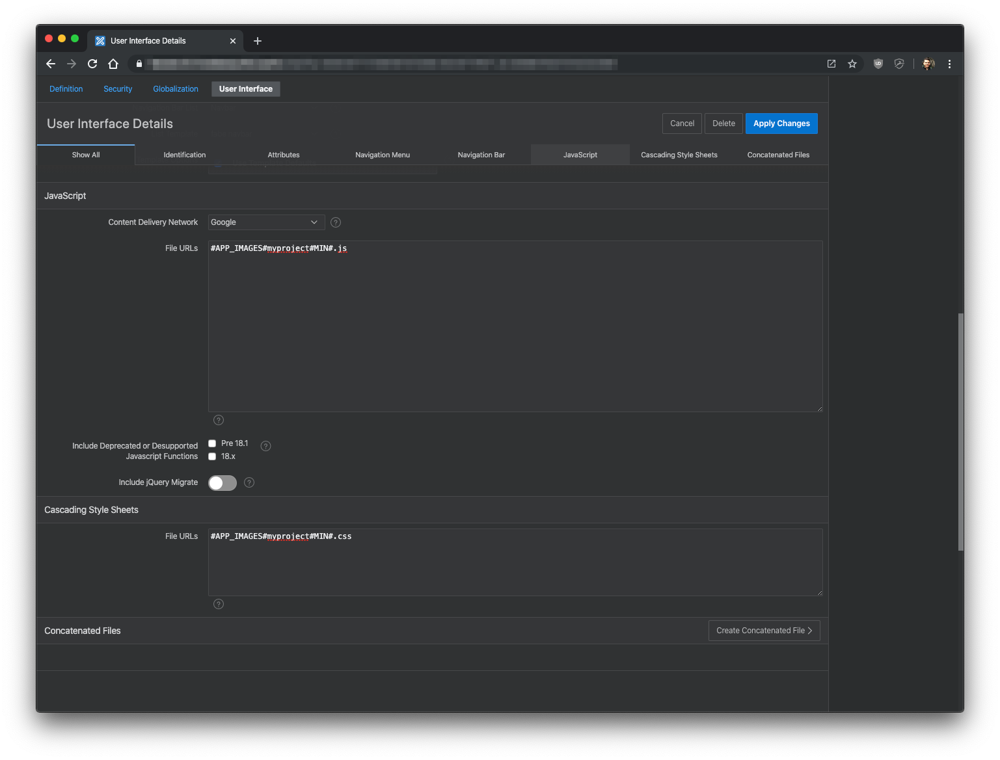
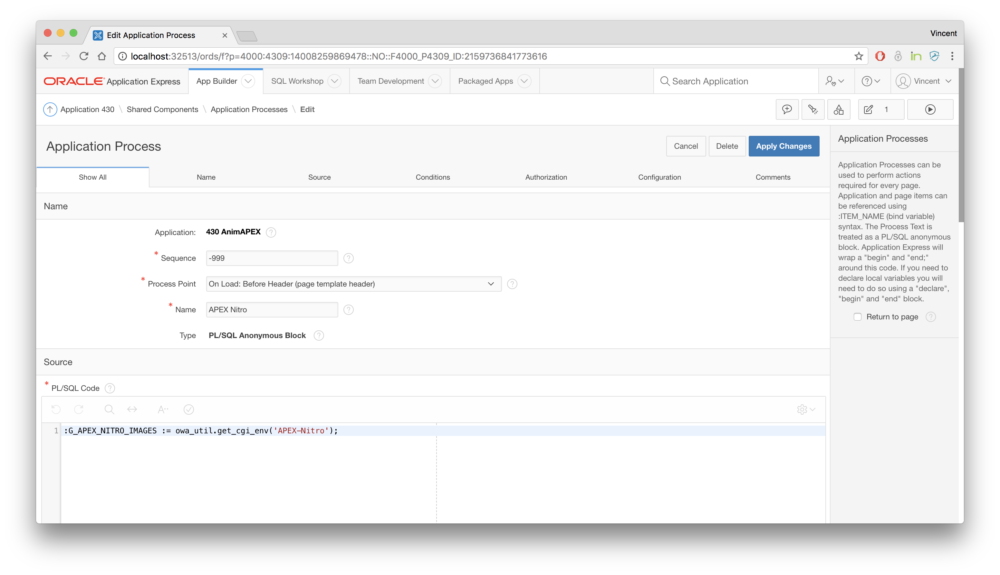

# APEX Application Setup

APEX Nitro requires two small additions to your APEX application to run properly.

### Build Option

APEX Nitro isn't meant to run in production. For security purposes, a build option is used to limit the scope of APEX Nitro only to the development environment.

Head to `Shared Components > Build Options` and create a new build option with the following attributes:

| Attribute         | Value      |
| ----------------- | ---------- |
| Build Option      | `DEV_ONLY` |
| Status            | `Include`  |
| Default on Export | `Exclude`  |

_Note: When you import an application in a different schema, anything tagged with the `DEV_ONLY` build option will not be run. If you re-import back into a development environment you'll need to manually change the status to `Include`._

### Application Process

Head to `Shared Components > Application Processes` and create a new application process with the following attributes:

| Attribute     | Value                                           | Comment                                                 |
| ------------- | ----------------------------------------------- | ------------------------------------------------------- |
| Name          | `APEX Nitro`                                    |                                                         |
| Sequence      | `-999`                                          | Ensures this happens first                              |
| Process Point | `On Load: Before Header (page template header)` |                                                         |
| Condition     | _see below #1_                                  |                                                         |
| Source        | _see below #2_                                  | Choose `PL/SQL Expression`                              |
| Build Option  | `DEV_ONLY`                                      | Ensures this only gets run in a development environment |

-   _#1 (condition)_

```sql
owa_util.get_cgi_env('APEX-Nitro') is not null
```

-   _#2 (source)_

```sql
apex_application.g_flow_images := owa_util.get_cgi_env('APEX-Nitro');
-- apex_application.g_company_images := owa_util.get_cgi_env('APEX-Nitro');
-- apex_application.g_theme_file_prefix := owa_util.get_cgi_env('APEX-Nitro');
-- :G_APEX_NITRO_IMAGES := owa_util.get_cgi_env('APEX-Nitro');
```

There are four choices (see commented lines), but you must pick one. Refer to the Matrix below to choose the best option for your application.

| Substitution String                  | Purpose                                                                                        | How to Use Examples                                                                |
| ------------------------------------ | ---------------------------------------------------------------------------------------------- | ---------------------------------------------------------------------------------- |
| apex_application.g_flow_images       | Application Static Files                                                                       | `#APP_IMAGES#js/app#MIN#.js` <br> `#APP_IMAGES#css/app#MIN#.css`                   |
| apex_application.g_company_images    | Workspace Static Files                                                                         | `#WORKSPACE_IMAGES#js/app#MIN#.js` <br> `#WORKSPACE_IMAGES#css/app#MIN#.css`       |
| apex_application.g_theme_file_prefix | Theme Static Files                                                                             | `#THEME_IMAGES#js/app#MIN#.js` <br> `#THEME_IMAGES#css/app#MIN#.css`               |
| :G_APEX_NITRO_IMAGES                 | Custom Application Item that contains the path of your files. Supports APEX plugin development | `&G_APEX_NITRO_IMAGES.js/app#MIN#.js` <br> `&G_APEX_NITRO_IMAGES.css/app#MIN#.css` |


* * *

### References

In APEX, you can reference your files at many levels

| Level       | Access Point                                                                                                             |
| ----------- | ------------------------------------------------------------------------------------------------------------------------ |
| Application | `Shared Components` > `User Interfaces` > `User Interface Details` > `JavaScript / Cascading Style Sheets` > `File URLs` |
| Theme       | `Shared Components` > `Themes` > `Create / Edit Theme` > `JavaScript and Cascading Style Sheets` > `File URLs`           |
| Theme Style | `Shared Components` > `Themes` > `Create / Edit Theme` > `Theme Styles` > `Create / Edit Theme Style` > `File URLs`      |
| Template    | `Shared Components` > `Templates` > `Edit Page Template` > `JavaScript / Cascading Style Sheet` > `File URLs`            |
| Plugin      | `Shared Components` > `Plug-ins` > `Create / Edit Plug-in:` > `File URLs to Load`                                        |
| Page        | `Page Designer` > `Page X` > `JavaScript / CSS` > `File URLs`                                                            |



* * *

### APEX Plugin Development

APEX Nitro supports plugin development as well. There is one additional setting to

-   Add an application item called `G_APEX_NITRO_IMAGES` 
-   In your application process code (see above), use `:G_APEX_NITRO_IMAGES := owa_util.get_cgi_env('APEX-Nitro');` 
-   In your plugin, under the section `Files`, add `&G_APEX_NITRO_IMAGES.` to the File Prefix: 

What that means for your environments:

-   In the development environment, `G_APEX_NITRO_IMAGES` will be populated when APEX Nitro is launched and the plugin file prefix will point to the APEX Nitro files.
-   In the production environment, `G_APEX_NITRO_IMAGES` will be empty, and the plugin file prefix will point to the database files as it should.
