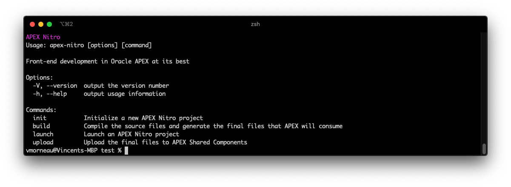
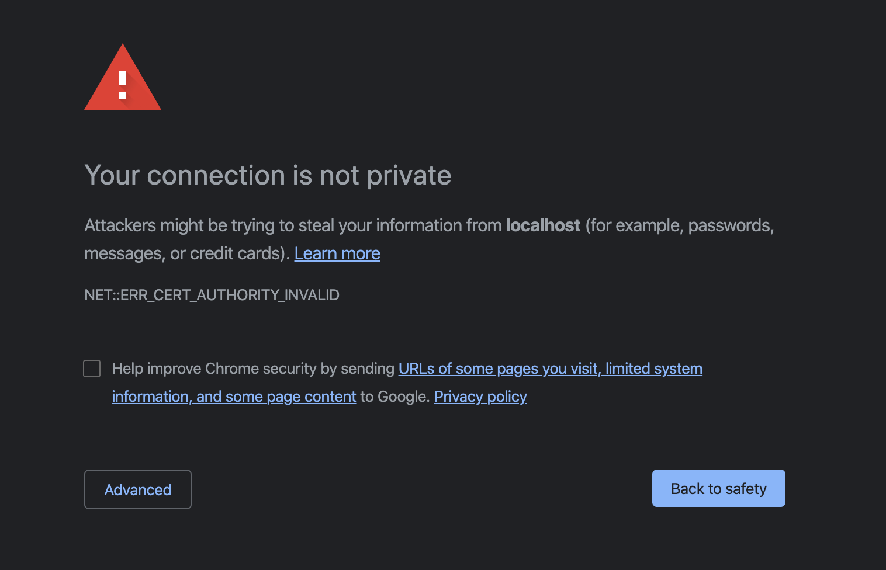
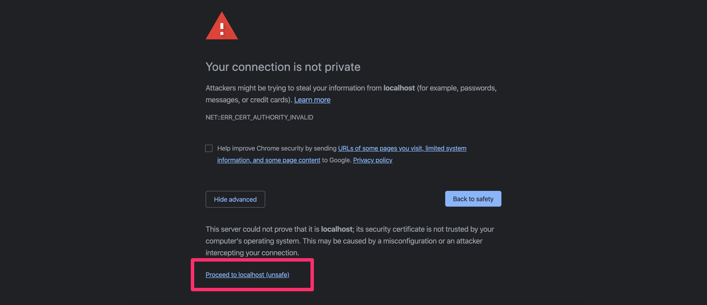

# Troubleshooting
Here are the most common issues people are having.

Please submit an issue on Github if you can't find a solution to your problem.

### Problems with the command line options?
Run `apex-nitro help`



### EACCES: permission denied
When installing using `npm install -g apex-nitro`, you might get an error like this:
```
gyp verb `which` failed Error: not found: python2
...
...
gyp ERR! stack Error: EACCES: permission denied, mkdir '/usr/local/lib/node_modules/apex-nitro/node_modules/node-sass/build'
...
...
```

It's because you are trying to `npm install` as root. You can either follow the official npm solution: https://docs.npmjs.com/getting-started/fixing-npm-permissions (recommended) or simply run the following:
```
sudo npm install -g --unsafe-perm apex-nitro
```

### EPERM: operation not permitted
Sometimes when you are trying to launch a project with `apex-nitro launch <project>`, you might get an error like this:

```
APEX Nitro
is now processing your files...
Error: EPERM: operation not permitted, mkdir 'C:\Users\vmorneau\Project\dist\css'
```

It means your operating system is locking the folder APEX Nitro is trying to delete and recreate. It creates a conflict with the operating system and APEX Nitro is unable to process your files.

It usually happens with you are trying to open the `/dist/` folder yourself. There is no need to open the `/dist/` folder yourself. Only the `/src/` folder is relevant to you.

To fix this, close down any program that might interfere with the `/dist/` folder (example: Windows Explorer, Finder, or your code editor) and start again.

### Error: Node Sass does not yet support your current environment
Sometimes when you are trying to launch a project with `apex-nitro launch <project>`, you might get an error like this:

```
(node:14488) UnhandledPromiseRejectionWarning: Unhandled promise rejection (rejection id: 1): Error: Node Sass does not yet support your current environment: Windows 64-bit with Unsupported runtime (57)
For more information on which environments are supported please see:
https://github.com/sass/node-sass/releases/tag/v3.13.1
(node:14488) [DEP0018] DeprecationWarning: Unhandled promise rejections are deprecated. In the future, promise rejections that are not handled will terminate the Node.js process with a non-zero exit code.
```

It is usually related to your Node.js environment that was updated. One of APEX Nitro's dependency (node-sass) sometimes gets corrupted. This is a known issue for node-sass.

The solution is simple: just run `npm rebuild -g node-sass` and try again.

Reference: https://github.com/sass/node-sass/issues/1764

### Unable to publish files
APEX Nitro allows you to automatically publish your files to APEX using this command: `apex-nitro publish <project>`

This is achievable only if you have configured SQLcl properly in your APEX Nitro configuration.

Start by reviewing your configuration using this command: `apex-nitro config <project>`

Look for a section called SQLcl and fill out the fields. You will need to have SQLcl locally on your system. No need to install anything, just point the SQLcl directory to the appropriate field of the APEX Nitro configuration.

This section is inspired by SQL Developer, and allows you to enter your database information using 4 different methods:
1- with SID
2- with Service Name
3- with TNS
4- custom connect string

APEX Nitro doesn't provide any way of validating your connection info. Please validate it yourself in SQL Developer if `apex-nitro publish <project>` doesn't work.

### APEX application doesn't pick up the changes from local files
APEX Nitro uses an HTTP header variable to communicate between the local files and the APEX application (with web sockets).

When APEX Nitro is launched, [this part](https://github.com/OraOpenSource/apex-nitro/blob/master/lib/gulp/browsersync.js#L21) initializes the HTTP variable. Unfortunately, this is not supported on an HTTP server from Oracle Forms (Weblogic).

See https://github.com/OraOpenSource/apex-nitro/issues/223 for more details.

### Self-signed SSL Warnings
When using APEX Nitro, you may encounter browser warnings before running your APEX application for the first time:



This is normal because you are serving the files from your own computer with self-signed certificates. Please continue.

You will access your APEX application normally, except for this icon near your browser's URL:



This is normal and it will only occur on your development environment.

### How to specify the file concatenation order?
Right now when you activate the concatenation option for JavaScript or CSS, APEX Nitro merges all your files together automatically under a new filename (also configurable in `apex-nitro config <project>`).

Sometimes you might want to specify an order for these files. Especially for CSS, the order is very important.

If you use the default settings of APEX Nitro, the concatenation is done automatically following an alphabetical order.

**The simplest way to specify an order to your files would be to name them alphabetically.** Example:
- css/001-header.css
- css/002-body.css
- css/003-footer.css
- js/001-util.js
- js/002-upload.js
- js/003-library.js

There are advanced methods for dealing with the concatenation order. Let's break it down for each language.

**JavaScript**
- In the APEX Nitro config, change the JavaScript processor to `webpack`
- Then you can use the `require` functionality, which allows you to import other JavaScript files in the order you want
- See this [example](../examples/demo-webpack/src/js)

**CSS**
- In the APEX Nitro config, change the CSS processor to `less` or `sass`
- Then you can use the `import` functionality, which allows you to inject other CSS files in the order you want
- See this [example](../examples/demo-sass/src/scss)
